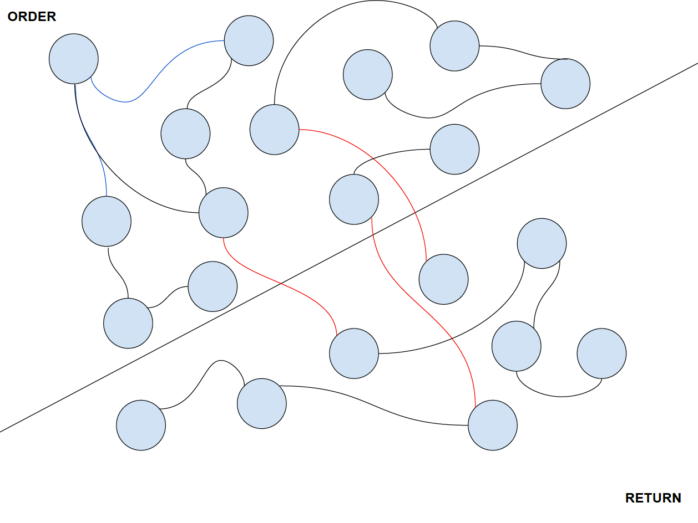
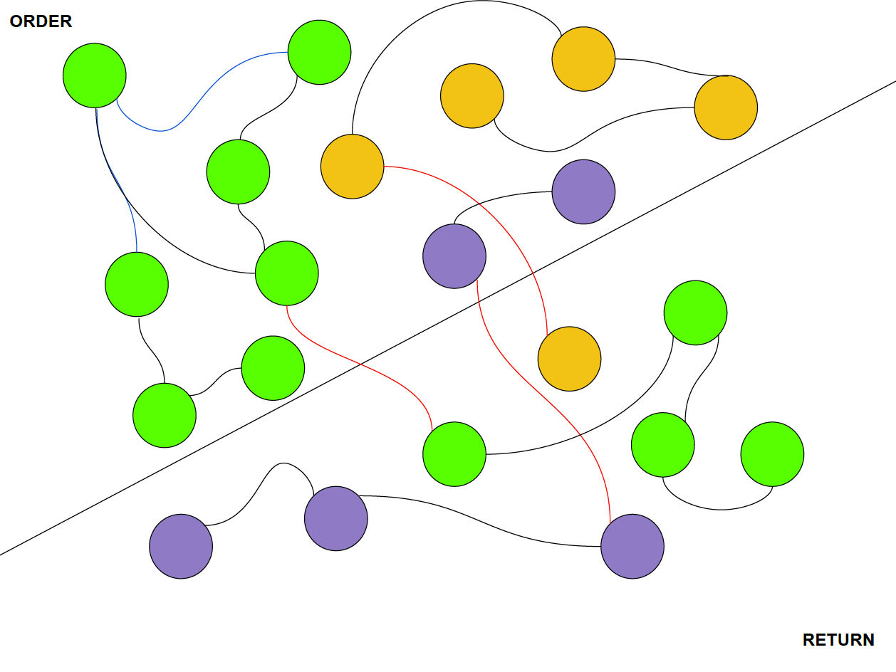

## Fluent Commerce Workflows Graph Visualization Tool

The objective of this tool is to provide a visual representation of how the Fluent Workflow events relate to each other, to help Developers and BAs to debug and track the proceses in the OMS.


This tool works by creating a **Graph** in which the Nodes are the Workflow Rulesets and 
the **Edges** represent the interaction that exist between them. Then it performs a graph analysis looking for **_“Clusters of Nodes”_** to create a view like the one above in which we can visualize how all the related Rulesets interact with each other. 

1) The tool creates one Node per each Ruleset in a set of Workflows.

2) It analyses the workflow to determine the relations (Edges) that exists between the nodes. We end up with a graph that can be analyzed.

3) The tool identifies the different “Clusters of Nodes” or “Subgraphs” that are formed.

4) The tool separates these Clusters and saves them in a database.


5) We can visualize the generated clusters in the tools panel:


**_Important Notes:_**
- The Tool works better when the names of the Rulesets are unique across the workflows, still there are some cases in which having repeated names does not affect it.
- The Tool has not been QAed properly. It’s on an Experimental phase yet. Always double-check the concussions you get out of the analysis you make of the Workflows with it.

## How to Run the Workflows Graph Visualization Tool

This tool is a Spring Boot MVC project build with Maven, that makes use of a documents database called JSONBD (http://jsondb.io/) and in the frontend utilizes the Javascript framework VIS.JS for the visualization on the graphs (https://visjs.org/).

1) Once you get the project folder you will need to configure the directory where the JSONBD database is going to store its files. This is an embedded in memory database and this is the only configuration it needs (no need to install extra tools). To do this, create a new empty directory and then open the file “fluentGraph/src/main/resources/application.properties”:


set the property “`jsondb.files`” with the path to the newly created directory.

**_Trouble Shooting Note:_**
_Once you start using the tool and if you get some issues with it, one way to “Reset it” is to delete ALL the contests of this directory, or to point the configuration property to a new empty Directory._

2) To run the tool there are two options.

A) If you are using IntelliJ you can import the project and install the SpringBoot plugin (https://www.jetbrains.com/help/idea/spring-boot.html). Once this is done you can click the play button in the upper panel and the application will be launched:


B) You can run it with your local Maven or with the packaged Maven wrapper:
```bash
# using packaged Maven wrapper 
 dflores$ ./mvnw spring-boot:run

 # OR local Maven
 dflores$ mvn spring-boot:run
```

In any case, if the tool launches correctly you should see an output similar to:


3) Once the tool is running open you browser and go to the URL “http://localhost:8080/home”, you should see the Tool’s Home Panel and if this is the first time it runs (or if the DB folder is empty) you will see something similar to:

This is normal since there are no workflows configured yet.

## How to Add, Edit and Remove Workflows from the Tool
To add a workflow to the Tool, go to the tools Home Panel in “http://localhost:8080/home”. Then in the “Add Workflow” section, specify the Name of the Workflow, the absolute path to its JSON file location and optionally check the “Enabled” checkbox (more on this property in the next section):


Click on add, and you should see the confirmation popup:


Now the workflow is configured in the tool:

You can add as many workflows as you need.

In the “**_Workflows Paths Config_**” section, you can update the Path of the Workflows or completely remove them:


## How to generate clusters and visualize them
In the Workflows section of the **Home Panel** chose the Workflows for which you want to generate the clusters by clicking on the checkboxes:


In above example we chose **RETURN_ORDER** and **BILLING_ACCOUNT**, so the generated clusters will show us how the Rulesets from this two workflows interact with each other.
Then click on “**_Generate_**”. You should see the confirmation popup and the list of generated clusters:


You can click on the Rulesets section to see which are contained in each cluster:


Click on the blue “**Cluster N**” label to visualize the cluster you want. A new window will open:


You can use the filter to look for a particular Ruleset:


By clicking on the Ruleset you need in the list, the view will focus on that particular Node and will display the Ruleset definition:

